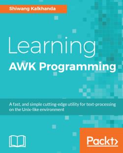

# 《Learning AWK Programming》Learning Notes


## 1. Profiles



|    **Title**    | **Learning AWK Programming** (9781788391030) |
| :-------------: | :------------------------------------------: |
|   **Author**    |            **Shiwang Kalkhanda**             |
| **Publication** |              **Packt, 2018.3**               |
|    **Pages**    |                   **416**                    |

> **Introduction**
>
> `AWK` is one of the most primitive and powerful utilities which exists in all Unix and Unix-like distributions. It is used as a command-line utility when performing a basic text-processing operation, and as programming language when dealing with complex text-processing and mining tasks. With this book, you will have the required expertise to practice advanced `AWK` programming in real-life examples.
>
> The book starts off with an introduction to `AWK` essentials. You will then be introduced to regular expressions, `AWK` variables and constants, arrays and `AWK` functions and more. The book then delves deeper into more complex tasks, such as printing formatted output in `AWK`, control flow statements, GNU's implementation of `AWK` covering the advanced features of GNU `AWK`, such as network communication, debugging, and inter-process communication in the `GAWK` programming language which is not easily possible with `AWK`.
>
> By the end of this book, the reader will have worked on the practical implementation of text processing and pattern matching using `AWK` to perform routine tasks.


## 2. Outlines

Status available：:heavy_check_mark: (Completed) | :hourglass_flowing_sand: (Working) | :no_entry: (Not Started) | :orange_book: (Read)

| No.  |                       Chapter Title                       |    Status     |
| :--: | :-------------------------------------------------------: | :-----------: |
| Ch01 |     [Getting Started with AWK Programming](./Ch01.md)     | :orange_book: |
| Ch02 |       [Working with Regular Expressions](./Ch02.md)       | :orange_book: |
| Ch03 |         [AWK Variables and Constants](./Ch03.md)          | :orange_book: |
| Ch04 |          [Working with Arrays in AWK](./Ch04.md)          | :orange_book: |
| Ch05 |            [Printing Output in AWK](./Ch04.md)            | :orange_book: |
| Ch06 |               [AWK Expressions](./Ch06.md)                | :orange_book: |
| Ch07 |         [AWK Control Flow Statements](./Ch07.md)          | :orange_book: |
| Ch08 |                [AWK Functions](./Ch08.md)                 | :orange_book: |
| Ch09 | [GNU's Implementation of AWK – GAWK (GNU AWK)](./Ch09.md) | :orange_book: |
| Ch10 |       [Practical Implementation of AWK](./Ch10.md)        | :orange_book: |


Powershell script for generating markdown files in batch:

```powershell
# Create 13 empty markdown files named Ch##.md:
for($i=1; $i -le 10; $i=$i+1){ New-Item -Name "Ch$('{0:d2}' -f $i).md"; }
```

 
